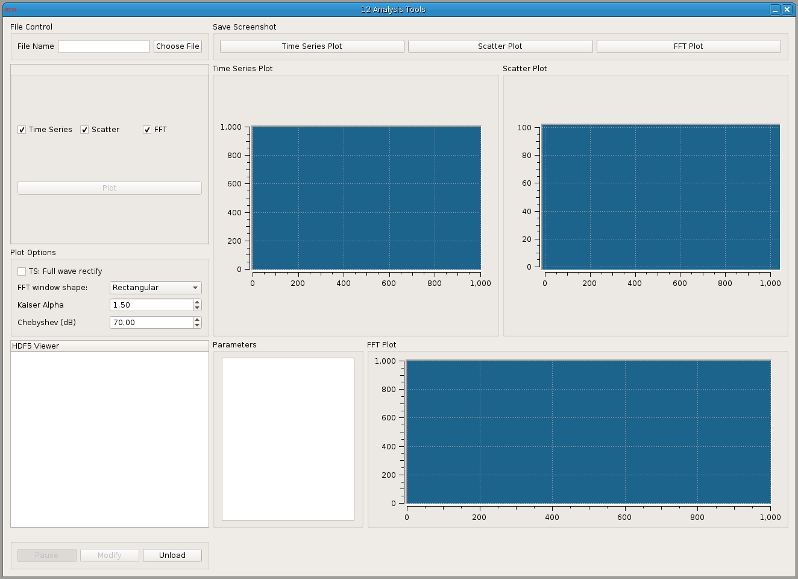

### Analysis Tools

**Requirements:** None  
**Limitations:** None  

<!--start-->

<b>Analysis Tools</b>

View HDF data recorded by the data recorder.
Simply open the file in the File Control Menu and click specific channels in
the HDF5 Viewer list. Under 'Plotting Options,' you can change from view from
time series to an FFT. To zoom in to the plot, use the mouse to click-and-drag
an area. Plots can be saved to PDF (via the Plot button), and data used in the
plot (both x and y axis) can be saved to a text file (via the Export
button)

 
<!--end-->

#### Input

#### Output

#### Parameters

#### States

